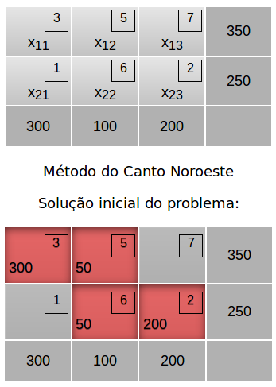
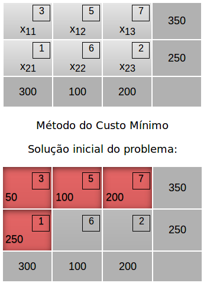

## Algoritmos De Transporte 

Foram implementados os Métodos do Canto Noroeste e do Custo Mínimo 

Para utilizar tenha o [Apache](http://httpd.apache.org/docs/2.4/install.html) e o [PHP](https://secure.php.net/manual/en/install.php) instalados em seu computador.

Digite no terminal 
    
    $ php -S localhost:8080

Equipe de desenvolvimento: [Euler](https://github.com/Rithie), [Priscyla](https://github.com/PriscylaSantos) e [Tamillys](https://github.com/Tamtuza)

